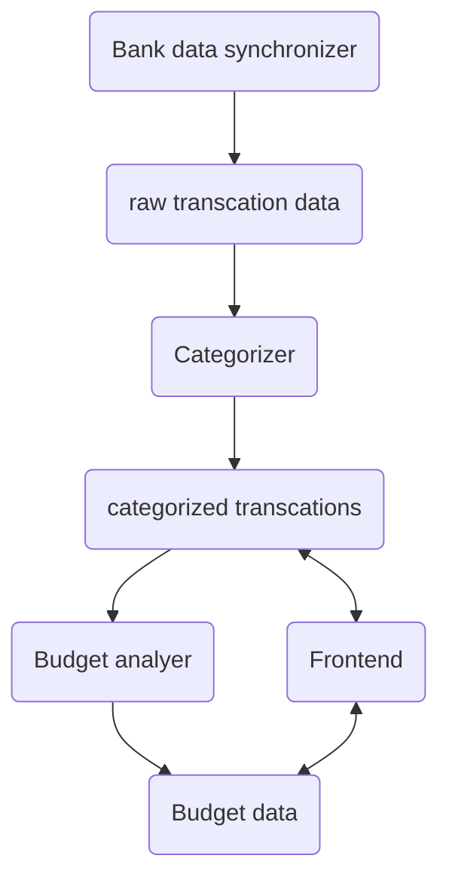
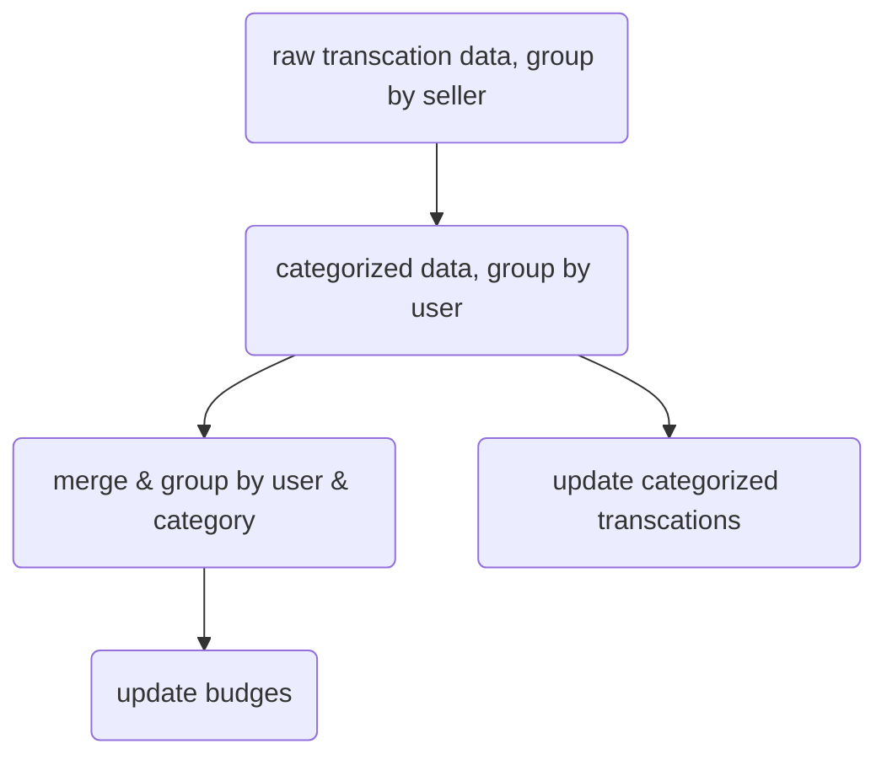

## Question

如何打造一個個人金融管理系統（mint.com），可以連結銀行帳戶、分析消費習慣及推薦
## Solutions
### Step 1: Scope the Problem
跟面試官討論
- 可以建立account、可以新增多個銀行帳戶、也可以之後再加
- 可以存取金融歷史，也可以根據銀行
- 金融歷史包括收入、支出、現金、投資
- 金融交易包含類別（食物、旅遊、衣服）
- 使用者可以新增自訂類別
- 使用者會取得根據其在的消費群裡的消費推薦
- 目前只需要網站，app之後討論
- 可能需要根據特定條件使用email 通知使用者
- 使用者不能根據自訂rule對交易進行分類
- 假設類別根據銷售商店，而不是價格或日期
### Step 2: Make Reasonable Assumptions
- 新增、移除帳戶相對少用
- 系統是write-heavy，一班使用者每天都會使用，少部分一週使用一次，通常透過email進入網站
- 交易可以被使用者更改類別，但只針對單筆，而不是所有交易歷史裡同一個交易改變
- 銀行不會自動更新資料到我們系統，我們需要自行從銀行取得
- 超出預算的通知不用立即通知，可以在一天內通知即可
### Step 3: Draw the Major Components

- 帳戶更新取決使用者使用頻率，可能每小時/每天
- 資料一開始先暫存，然後交給Categorizer分類後才存到資料庫
- Budget analyer query 分類交易，並儲存使用者的消費
- 前端存取categorized transcations及Budget data的資料，使用者可以改變Budget、類別進行不同的查詢
### Step 4: Identity the Key Issues
- 這是一個data-heavy的系統，為了讓他可以即時反應，會使用非同步（asynchronous）處理
- 有一個task queue，可能包含：擷取銀行資料、重複分析預算、分類銀行資料
- 將task 分優先順序，並確保低優先順序會執行得到
- 假設有很多人註冊不使用，那可能需要凍結或移除
- 可以非同步、使用不同server執行
#### Categorizer and Budge Analyzer
- 一瞬間可能有很多資料，可能不適合使用中心資料庫（沒效率）
- 使用檔案存取可能優於資料庫，並使用商家的名稱命名
- categorizer 流程可能如下：

- 根據商家分類資料，有可能存在cache
- 再根據使用者group，這些交易再根據使用者新增進資料庫
- 原本：商家>使用者、price、日期
- 處理完：使用者>商家>類別>price、日期
#### User Changing Categories
- 重新計算類別，並且找尋該使用者之前的記錄修改
### Follow up
- 如果要讓他可以支援mobile app，要怎麼設計？
- 如何設計一個component將item 分類
- 如何設計推薦預算的feature
- 使用者若要可以自訂rule分類交易商家，要怎麼做？